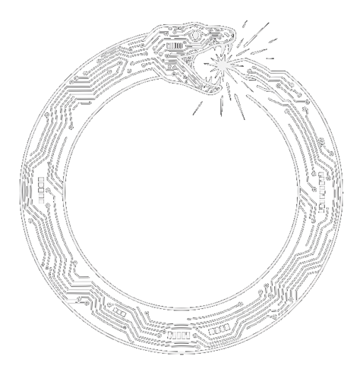

<p align="center">
  <picture>
    <source media="(prefers-color-scheme: dark)" srcset="assets/logo-dark.png">
    <source media="(prefers-color-scheme: light)" srcset="assets/logo-light.png">
    
  </picture>
</p>

# Bulwark

> Gate an agent's file reads at the OS, by inode, before the bytes reach it.

Bulwark is an OS-level read gate for running AI coding agents on a developer
machine. Launch an agent under it; when any process in its tree tries to `open()`
a protected file, Bulwark applies a policy before the bytes reach the agent: deny,
allow, or ask for consent. On Linux it uses fanotify permission events; on macOS,
Endpoint Security. Hardened mode adds a Landlock floor so protected paths stay
denied even if the userspace gate dies.

[](https://github.com/obstalabs/bulwark/actions/workflows/ci.yml)

[](LICENSE)

```sh
# Run an agent, but deny it any read of your SSH keys — enforced by the kernel.
brew install obstalabs/tap/bulwark
sudo bulwark run --protect ~/.ssh -- claude
#   the agent works normally; cat ~/.ssh/id_ed25519  ->  Permission denied
```

## What Bulwark is

It supervises a process tree, installs a fanotify `FAN_OPEN_PERM` mark, and
decides each open by the file's **inode**, not its path string. A protected inode
opened by the supervised tree is denied; the reader gets `EPERM`. Every decision
is logged with the process ancestry that caused it.

The point is that the boundary is an OS-mediated checkpoint, not a rule in a
prompt the agent can be talked past.

## What Bulwark is NOT

- **Not redaction.** It does not scrub or obfuscate secrets out of content. (That
  is [NeuroRouter](https://neurorouter.dev)'s job.) It stops the open from
  happening at all.
- **Not an authority/approval system.** It does not decide *who* may act. (That is
  Verdict's job.)
- **Not a network or routing gate.** It does not see or stop exfiltration over
  the wire. (That is [NeuroRouter](https://neurorouter.dev)'s job.)
- **Not protection for secrets already inside the allowed workspace.** Bulwark
  bounds what the tree can *reach*, not what it already holds.
- **Not protection against an unwrapped process.** Only the tree launched under
  `bulwark run` is gated — including work the agent *delegates* to a separate daemon.
  An agent that calls `docker run` hands the read to `dockerd` (a different tree), so it
  is not gated; the standard rule applies — don't give a confined agent a root-equivalent
  socket. The full tested boundary is in
  [docs/containment-boundaries.md](docs/containment-boundaries.md).

One mechanism — gate the `open()` — with a few policies layered over it
(deny-list, allow-list, consent, a crash-safe hardened floor).

## Philosophy

*Principiis obsta* — resist the beginning. A security boundary must not depend
on a prompt or a guess. Bulwark prevents the dangerous condition structurally
rather than detecting it after the fact: the kernel is the evidence source, not
the agent's self-report; the decision is deterministic, not probabilistic; the
identity is the inode, not a string a symlink can forge.

## Quick start

> Linux (fanotify) and macOS (Endpoint Security). The gate needs root —
> `CAP_SYS_ADMIN` for fanotify on Linux, root + Full Disk Access on macOS
> ([why, and how to set it up](docs/macos-permissions.md)). Prebuilt binaries:
> `brew install obstalabs/tap/bulwark` or the **[Releases page](https://github.com/obstalabs/bulwark/releases)**.

```sh
cargo build --release

# Deny the supervised command any read of files under ~/.ssh, by inode.
sudo ./target/release/bulwark run \
  --protect ~/.ssh \
  --receipts /tmp/bulwark-receipts.jsonl \
  -- bash -c 'cat ~/.ssh/id_ed25519'   # -> cat: Permission denied
```

A benign-named symlink to a protected file is still denied — the decision is by
inode, so the name cannot lie.

## Usage

```
bulwark run --protect <PATH> [--protect <PATH>...] [--receipts <FILE>] -- <CMD>...
```

- `--protect <PATH>` — protect a file or directory by inode (directories expand
  to their immediate entries' inodes at launch). Repeatable, at least one
  required.
- `--receipts <FILE>` — append one JSON-line receipt per decision.
- everything after `--` is the supervised command.

Receipts are JSON lines:

```json
{"ts_ms":1717377600000,"pid":959596,"dev":43,"ino":192214,"decision":"deny","path":"/tmp/guard/secret.env","ancestry":"cat(959596) <- bash(959591)","reason":"protected inode opened by supervised tree"}
```

## Architecture

```
bulwark run --protect <path> -- <cmd>
      │
      ├── resolve protected paths -> (dev, ino) set          [protect.rs]
      ├── fanotify_init + FAN_OPEN_PERM mark (before fork)    [gate.rs]
      ├── fork/exec <cmd>                                     [gate.rs]
      └── event loop:
            open() by tree  ──►  kernel pauses the open
                                  fstat(event fd) -> (dev, ino)   [gate.rs]
                                  in supervised tree?             [proctree.rs]
                                  inode protected?                [protect.rs]
                                    yes -> FAN_DENY (EPERM)
                                    no  -> FAN_ALLOW
                                  log decision + ancestry         [receipt.rs]
```

## Modes

- **Deny-list (default):** protect specific paths; everything else is allowed.
  With `--consent socket`, a protected open is held and an operator answers
  off-band (allow-once / allow-session / deny / deny-forever). Without it,
  protected opens are denied.
- **Allow-list (`--deny-all`):** default-deny for CI/CD — the agent may read
  only `--allow` paths plus the runtime base set, every other read denied, no
  prompt. See `docs/ci-allowlist.md`.
- **Hardened (`--hardened`):** the allow-list enforced as a kernel-level
  Landlock floor instead of via the fanotify supervisor. Crash-safe — the
  restriction is in the kernel on the agent itself, so `SIGKILL`/crash cannot
  widen access. See `docs/hardened-mode.md`.

Not sure which mode fits, or wrapping an agent launcher so every run is confined?
See [docs/modes-and-wrapping.md](docs/modes-and-wrapping.md).

Tree membership is decided by control-group membership (Linux) or a process set
tracked from kernel fork/exec/exit events (macOS), recorded when each process is
created — not by walking the parent chain at read time. So a descendant that
deliberately orphans itself with a double-`fork()` is still attributed to the
tree and gated, rather than escaping by shedding its parent link. The tested
matrix is in [docs/containment-boundaries.md](docs/containment-boundaries.md).

## Agent-operated, but the clamp is a ratchet

Bulwark is built to be operated by an agent, not only a human: in a fleet, an
orchestrator dispatching a sub-agent onto a sensitive host clamps that sub-agent's
reach at dispatch. The restrainer is itself an agent — which is why Bulwark ships
an ANCC contract ([`docs/SKILL.md`](docs/SKILL.md)), so an orchestrator can read
its interface and apply the clamp programmatically.

Handing an agent the lever is only safe because the lever turns one way.
**Tightening** a clamp (adding `--protect`, narrowing an allowlist) is
agent-initiated and free. **Widening or removing** one routes through the off-band
consent path (`--consent socket`), where a human answers over a channel the
supervised tree cannot see or forge. *An agent can clamp; it cannot un-clamp.*
ANCC-compliance here is about who pulls the lever, not who gets restricted — and
a lever an agent may pull must be a ratchet.

## Integrity circuit-breaker

Each run records its integrity context — a generation counter, a clean-shutdown
marker, the policy epoch, and the inode identity of every protected object — to a
state file. The next run enters **tainted mode** when the prior run ended
uncleanly (no clean-shutdown marker: a `SIGKILL`, crash, OOM, or power loss) or
when a protected path now resolves to a different inode (object-identity drift).

A tainted run denies protected reads by default and, in socket mode, bypasses the
allow-session cache so every protected open is decided fresh — no pre-taint grant
survives. The taint is sticky and persists across restarts until an operator
reviews the audit receipt (`source: "integrity"`) and acknowledges it:

```sh
bulwark reset   # clears the taint marker after review
```

This bounds the blast radius *after* an unclean recovery. It does not change the
held-read fail-open behaviour at the instant of a hard kill — that is what
`--hardened` is for.

## Security review

Before the enforcement was opened publicly it went through repeated adversarial
review — attacking the gate, fixing what was found, then attacking the fixes —
until two consecutive rounds found nothing a supervised agent could reach. That
pass surfaced around a dozen-and-a-half issues, including a few that the first
round of fixes introduced; each is closed with a regression test that fails on
the pre-fix code and passes on the fixed code, verified on real hardware (Linux
kernel 6.12, macOS 26). The boundaries Bulwark does **not** cross are documented
as plainly as the ones it does — see **Known limitations** below and
[docs/containment-boundaries.md](docs/containment-boundaries.md).

## Known limitations

- **Reads, not consequences.** Bulwark gates file opens; it does not stop use of
  data already read, environment-variable credentials, or network exfiltration.
  Pair it with an egress control.
- **fanotify modes fail open on hard supervisor death.** A `SIGKILL`/crash while
  a read is held releases that read as allowed (documented kernel behaviour); a
  graceful `SIGTERM` fails closed. The `--hardened` (Landlock) mode is crash-safe
  and does not have this limitation. The integrity circuit-breaker (below) bounds
  the blast radius *after* such an event but does not change the held read at the
  moment of the kill.
- Allow-list/hardened modes allow a runtime base set (`bulwark base-set`) so the
  agent can execute — a deliberate, inspectable trade-off.
- **Daemon-delegated reads are outside the tree.** Bulwark governs the process tree it
  launched. Work the agent hands to a separate daemon — e.g. `docker run`, which
  delegates to `dockerd` — happens in a different tree and is not gated; this is the
  standard root-equivalent-socket boundary, not a Bulwark-specific gap. The agent's own
  attempt to escape into a new mount namespace *is* blocked under `--hardened`. Full
  tested matrix: [docs/containment-boundaries.md](docs/containment-boundaries.md).
- macOS support requires a signed Endpoint Security edge and **Full Disk Access** for
  the launching terminal (without it the gate cannot start). Why that's needed, how
  the gate is wired, and the common setup errors are in
  [docs/macos-permissions.md](docs/macos-permissions.md); see also
  [docs/macos.md](macos.md).
- Requires root (`CAP_SYS_ADMIN` for fanotify; Endpoint Security privilege on
  macOS; Landlock for `--hardened`).

## Roadmap

- The managed remote trust channel (mutual-TLS, signed grants) — the Pro
  hardening of `bulwark ssh`.
- Fleet control plane, centralized audit, signed managed daemons (Pro).
- Windows support (minifilter gate) — under research.

## License & positioning

**Local enforcement is open. Managed trust is paid.**

The line is architectural, not a feature flag: if it runs entirely on your own
machines, it is open source; if it depends on Obsta-operated trust, identity,
availability, fleet policy, audit, or signed grants, it is the commercial tier.

**Bulwark Core** is licensed **AGPL-3.0-or-later** (see [LICENSE](LICENSE)) and
covers self-managed local enforcement:

- the read gate (`bulwark run --protect`)
- local off-band consent (`--consent socket`)
- the CI allowlist (`--deny-all`)
- the crash-safe Landlock floor (`--hardened`)
- the peer `bulwark ssh` mechanism, when you own both ends

You can read exactly what the gate does and how it decides; the security
boundary is inspectable by design. Local Linux functionality is never gated by a
license check.

**Bulwark Pro / Fleet** is the commercial tier — managed trust for teams, which
is the part you do not want to run yourself:

- the remote trust channel: mutual-TLS / certificate issuance and a signed-grant
  authority (the production hardening of `bulwark ssh`)
- managed daemon identity and fleet policy distribution
- a centralized, tamper-evident audit pipeline
- team approval flows and an operator cockpit
- an SLA on the consent and trust channel

`bulwark ssh` is the *mechanism* and is open; the *managed trust* around it —
reliable authority across machines, users, agents, and audit boundaries — is the
product. The local enforcement is open; the managed infrastructure on top is the
paid line.

Copyright © 2026 Obsta Labs.
